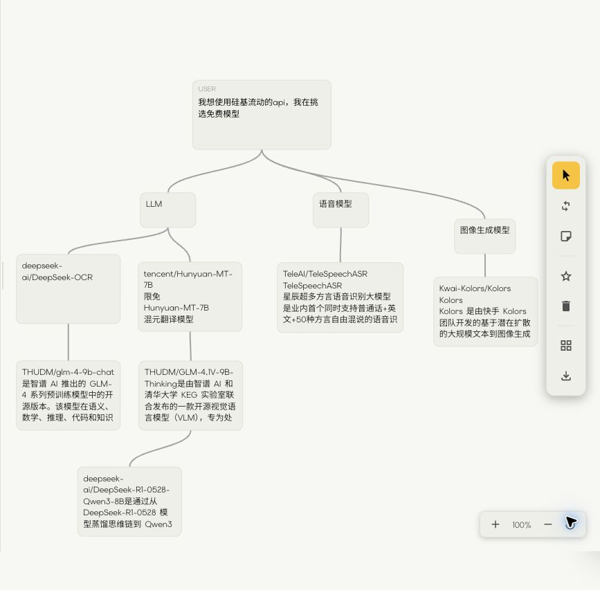
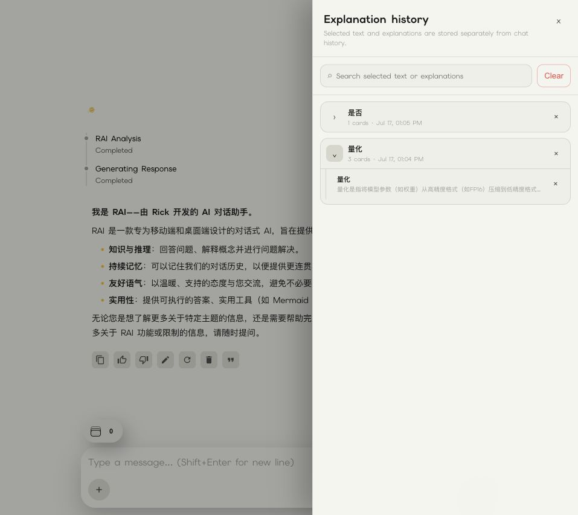

<p align="right">
  <a href="./README.md"><strong>English</strong></a>
</p>

<div align="center">


# RAI

### 为思考、研究与共同构建想法而设计的人机交互式对话 AI

RAI 把智能模型路由、联网检索、多模型研究、ChatFlow 可视化画布和选词解释
整合进一个克制、响应式的工作空间。

<p>
  <a href="https://rai.rick.sarl"><strong>立即体验 RAI →</strong></a>
  &nbsp;·&nbsp;
  <a href="https://github.com/Rick-953/RAI/releases/latest">最新版本</a>
  &nbsp;·&nbsp;
  <a href="#自行部署">自行部署</a>
</p>

[](https://github.com/Rick-953/RAI/releases/latest)
[](https://nodejs.org/)
[](https://sqlite.org/)
[](./LICENSE)

</div>


<p align="center"><em>自然地提问，自主选择思考深度，并始终掌握交互过程。</em></p>

## 为什么是 RAI

RAI 是一款注重**人机交互**、源码公开的对话式 AI 软件。它关注的不只是接入另一个模型接口，而是人与 AI 如何顺畅地一起思考和完成工作。

- 从**智能模型**开始，也可以随时手动指定模型。
- 自主决定让 RAI 快速回答、深入推理、联网搜索或执行研究。
- 支持编辑、引用、重新生成、中止回答和在生成过程中插话。
- 不切换工具，就能把对话继续整理成可视化画布。
- 选中不熟悉的词句，在原位置获得聚焦解释并继续追问。
- 在简体中文、繁体中文和英文之间使用同一套响应式界面。

正式可用官网为 **[rai.rick.sarl](https://rai.rick.sarl)**。你可以先在线体验，再决定是否自行部署。

## 核心体验

### 自适应对话

让 RAI 在当前账号可用的模型之间智能路由，或直接控制模型、推理模式和联网能力。流式回答可以随时停止、编辑、引用、重新生成，也可以在模型尚未完成时插入补充要求。

### 多视角研究

快速研究和深度研究可以规划任务，并行运行最多四个专项子 Agent，再由主模型综合并校验结果。Tavily 联网搜索会在需要新鲜信息时提供来源，财务工具可查询行情与历史数据。

### ChatFlow：让对话变成结构

ChatFlow 把持久对话和节点画布放在一起。你可以把想法拖进画布、建立关系、让 AI 重组或拆解结构，在应用之前审核修改，撤销改动、自动布局，并导出 PNG、SVG、Mermaid 或 JSON。

### 在原位置解释任何内容

选中消息、ChatFlow 或另一张解释卡片里的术语、句子或公式，RAI 会把聚焦解释流式写入轻量卡片。卡片可以拖动、最小化、继续分支追问，并在账号同步的解释树中搜索和管理。

### 一个界面承载丰富回答

RAI 可渲染 Markdown、代码高亮、KaTeX 数学公式、Mermaid 图表、图片和带来源的联网结果。它可以从现代 PDF、DOCX、XLSX/CSV、PPTX、文本和代码文件中提取上下文；兼容的多模态模型还可以接收图片。

### 账号、记忆与安全

服务端内置邮件账号、bcrypt 密码哈希、JWT 会话、Authenticator 两步验证、Passkey/WebAuthn、可选长期记忆、临时对话、配额、公告和管理后台。实例管理员可以控制模型与能力是否开放。

## 实际界面

### 自主选择 RAI 的工作方式


<p align="center"><em>不离开输入框，即可切换快速、思考、研究或直接选择模型。</em></p>

### 把对话继续整理成视觉工作区



<p align="center"><em>ChatFlow 让结构化、可编辑的画布与对话并存。</em></p>

### 建立可继续追问的解释树



<p align="center"><em>选词与后续解释保存在独立、可搜索的树中，不混入普通聊天记录。</em></p>

## 能力一览

| 分类 | 主要能力 |
| --- | --- |
| 对话 | 流式输出、停止、编辑、引用、重新生成、评价、生成中插话、同步历史、临时对话 |
| 模型 | 智能路由，以及可配置的 DeepSeek、Qwen、Kimi、OpenRouter、Gemini、Claude、Nemotron、Mimo Code、Gemma 路由 |
| 研究 | 带来源的联网搜索、快速/深度多 Agent 研究、综合校验、Yahoo Finance 数据 |
| ChatFlow | 持久画布、AI 修改审核、撤销、语义连线、自动布局、PNG/SVG/Mermaid/JSON 导出 |
| 理解 | 选词解释卡、嵌套追问、拖动与最小化、树状搜索历史 |
| 内容 | Markdown、代码高亮、KaTeX、Mermaid、图片和现代文档解析 |
| 个性化 | 可选长期记忆、浅色/深色/跟随系统主题、三种界面语言、浏览器通知 |
| 账号与运维 | 邮件认证、密码重置、TOTP 两步验证、Passkey、配额、点数/会员、管理与统计 |

> 模型、推理、搜索、研究、图片和邮件能力取决于实例管理员实际配置的上游服务。

## 在线体验

在现代浏览器中打开 **[https://rai.rick.sarl](https://rai.rick.sarl)**。正式官网是了解 RAI 当前交互设计和功能的最快方式。

## 自行部署

### 环境要求

- Linux、macOS 或其他受 Node.js 支持的环境
- **Node.js 20.17.0 或更高版本**及 npm
- 可持久写入 `ai_data.db*`、`uploads/`、`avatars/` 和生成图片的磁盘空间
- 解析 XLSX/PPTX 需要 `unzip`；若当前平台没有原生依赖预编译包，可能还需要构建工具和 Python
- 至少配置一个对话模型上游，才能获得可用的 AI 回答
- 生产环境使用 Passkey 时需要 HTTPS 和真实域名

RAI 当前面向**单个 Node.js 进程**。SQLite 与部分内存协调逻辑不适合 PM2 cluster 或横向多实例部署。

### 快速开始

```bash
git clone https://github.com/Rick-953/RAI.git
cd RAI
npm ci --omit=dev

cp .env.example .env
# 编辑 .env：替换所有占位符和 RAI 官方实例域名。

npm run check
node --env-file=.env server.js
```

然后打开 `http://127.0.0.1:3009`，或验证服务：

```bash
curl -fsS http://127.0.0.1:3009/api/version
```

RAI 读取的是**进程环境变量**，服务端不会自动加载 `.env`。请使用 `node --env-file=.env server.js`，或让 systemd、PM2 等进程管理器显式注入环境。只有在环境变量已经存在于进程中时，直接运行 `npm start` 才是完整的启动方式。

### 必填密钥

服务启动至少需要：

- `JWT_SECRET`：不少于 32 个字符
- `ADMIN_JWT_SECRET`：不少于 32 个字符，并且必须与 `JWT_SECRET` 不同
- `ADMIN_PASSWORD_HASH`：bcrypt 哈希值，不能填写明文密码

在本机生成合适的值：

```bash
openssl rand -hex 32
openssl rand -hex 32
node -e 'require("bcrypt").hash(process.argv[1], 12).then(console.log)' \
  'replace-with-a-strong-admin-password'
```

把两个随机值与生成的 bcrypt 哈希填入 `.env`，绝不要提交这个文件。

本地开发时，请把 `.env.example` 中的正式域名替换为本地来源，设置 `TRUST_PROXY=0`，并设置 `RAI_DEFAULT_DOMAIN_NOTICE_ENABLED=false`。生产环境则应配置精确的公网来源，并让 Passkey 的 relying-party 设置与域名保持一致。

### 上游服务配置

| 环境变量 | 启用能力 |
| --- | --- |
| `DEEPSEEK_API_KEY` | DeepSeek 对话与推理路由 |
| `SILICONFLOW_API_KEY` | 已配置的 Qwen/Kimi 路由与图片生成 |
| `OPENROUTER_API_KEY` | OpenRouter 模型路由 |
| `GOOGLE_GEMINI_API_KEY` | Gemini 路由 |
| `TAVILY_API_KEY` | 联网搜索与带来源的时效信息 |
| `RESEND_API_KEY` + `RESEND_FROM_EMAIL` | 注册验证、邮件验证码登录和密码重置 |
| `ZTX6D_APP_ID` + `ZTX6D_APP_KEY` | 可选 ZTX6D 登录 |

不必配置所有上游，但每项功能都需要对应服务。向公众开放注册前，请先检查上游计费、配额、数据政策和模型可用性。

## 生产环境部署

### 1. 准备应用

创建非特权 `rai` 服务账号，并让它拥有 `/opt/rai` 等独立应用目录，然后以该账号安装：

```bash
sudo -u rai git clone https://github.com/Rick-953/RAI.git /opt/rai
sudo -u rai npm ci --omit=dev --prefix /opt/rai
sudo -u rai cp /opt/rai/.env.example /opt/rai/.env
sudo chmod 600 /opt/rai/.env
```

编辑 `.env`，至少设置：

```dotenv
NODE_ENV=production
HOST=127.0.0.1
PORT=3009
TRUST_PROXY=1
PUBLIC_BASE_URL=https://rai.example.com
CORS_ORIGINS=https://rai.example.com
RAI_PASSKEY_ALLOW_LOCALHOST=false
RAI_DEFAULT_DOMAIN_NOTICE_ENABLED=false
```

同时替换 JWT 密钥、管理员哈希、模型上游、邮件配置、回调地址、HTTP referer 和运行报告路径。只有当请求恰好经过一层可信反向代理时，才使用 `TRUST_PROXY=1`。

### 2. 使用 systemd 运行

创建 `/etc/systemd/system/rai.service`，并按服务器实际情况替换用户、用户组、Node 路径和应用路径：

```ini
[Unit]
Description=RAI conversational AI
After=network-online.target
Wants=network-online.target

[Service]
Type=simple
User=rai
Group=rai
WorkingDirectory=/opt/rai
ExecStart=/usr/bin/node --env-file=/opt/rai/.env /opt/rai/server.js
Restart=on-failure
RestartSec=5
NoNewPrivileges=true
PrivateTmp=true

[Install]
WantedBy=multi-user.target
```

先用 `command -v node` 确认正确的 Node 路径，然后启用服务：

```bash
sudo systemctl daemon-reload
sudo systemctl enable --now rai
sudo systemctl status rai
```

PM2 的 **fork 模式**也可以使用，但必须完整注入环境变量。不要对本应用使用 cluster 模式。

### 3. 配置 HTTPS 反向代理

Nginx 需要保留代理头、允许上传，并为流式回答关闭缓冲：

```nginx
server {
    listen 443 ssl http2;
    server_name rai.example.com;

    client_max_body_size 20m;

    location / {
        proxy_pass http://127.0.0.1:3009;
        proxy_http_version 1.1;
        proxy_set_header Host $host;
        proxy_set_header X-Real-IP $remote_addr;
        proxy_set_header X-Forwarded-For $proxy_add_x_forwarded_for;
        proxy_set_header X-Forwarded-Proto $scheme;

        proxy_buffering off;
        proxy_cache off;
        proxy_read_timeout 600s;
        proxy_send_timeout 600s;
        add_header X-Accel-Buffering no;
    }
}
```

使用 Certbot、Caddy 或其他可信 ACME 客户端签发 TLS 证书。除明确允许的 localhost 开发环境外，Passkey 需要 HTTPS 与精确来源。

### 4. 持久化、备份与验证

每次升级前持久保存并备份：

- `ai_data.db`、`ai_data.db-wal` 与 `ai_data.db-shm`
- `uploads/` 和生成图片
- `avatars/`
- `.env` 与外置运行报告

服务运行时应使用 SQLite 在线备份；若要直接复制数据库文件，应先停止进程。绝不能用新版发布包覆盖密钥、数据库、上传、头像或用户数据。

部署后检查：

```bash
cd /opt/rai
npm run check
curl -fsS http://127.0.0.1:3009/api/version
curl -fsS https://rai.example.com/api/version
```

在具备完整测试环境的源码目录中，可以执行更完整的回归门禁：

```bash
npm run test:formal-audit
```

## 安全与数据说明

- 绝不要提交 `.env`、上游密钥、JWT 密钥、管理员凭据、数据库、上传、头像、日志或运行报告。
- 自行部署可以控制 RAI 服务端与数据库，但提示词和文件仍可能被发送到你配置的 AI、搜索、邮件、财务和图片服务商。
- Node 仅监听本机地址并置于可信 HTTPS 反向代理之后；CORS 应尽量收窄，只为已知代理拓扑启用 `TRUST_PROXY`。
- 用户上传受访问控制；头像和生成图片通过静态路径交付，请按部署场景评估其暴露范围。
- 向不受信任用户开放服务前，请配置请求限制、上传配额、上游预算与注册策略。
- 备份 SQLite 时要连同 WAL 状态一起处理，并实际测试恢复，而不只是确认备份文件存在。

## 版本与开发检查

README 不再堆放更新日志。当前版本说明、迁移细节和可下载产物统一放在 **[GitHub Releases](https://github.com/Rick-953/RAI/releases)** 页面。

常用本地检查：

```bash
npm run check
npm run test:formal-audit
npm audit --omit=dev
```

欢迎提交边界明确的 Issue 和 Pull Request。请勿在提交或错误报告中放入真实密钥、用户数据、数据库和运行产物。

## 许可证

RAI 源码公开，可用于个人、教育、研究、评估及其他非商业用途。公司内部部署、付费托管、SaaS、咨询和商业再分发等商业使用，需要事先获得维护者的书面许可。

完整条款见 **[LICENSE](./LICENSE)**。当前许可属于个人及非商业的源码公开许可证，并非 OSI 认可的开源许可证。
